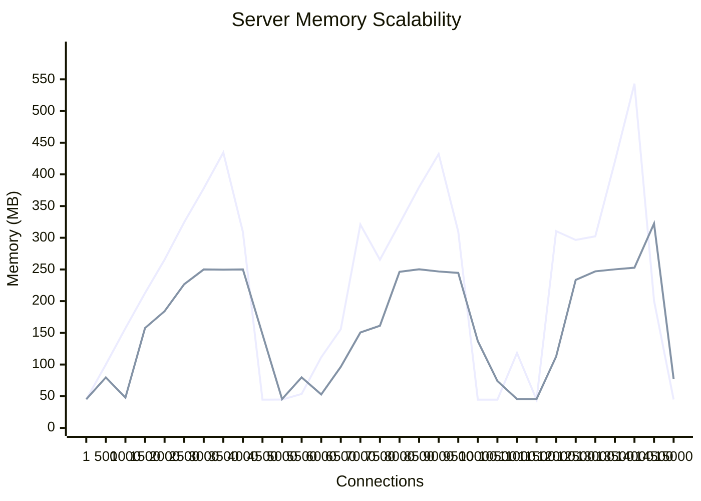
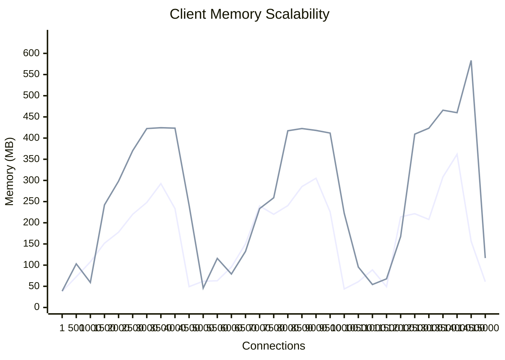
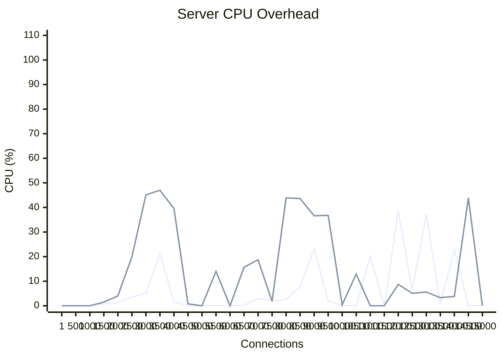
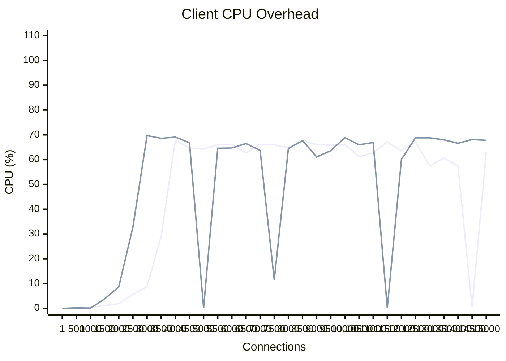

# High-Concurrency Keep-Alive Performance Report (Native Bounds)

## Overview
This document evaluates the resource utilization of the **Ruby 4.0.2** Fiber-based client/server architecture under varying levels of concurrent keep-alive connections. Given the macOS strict ephemeral port limitations of `~16,383` single-target connections, the testing bounds here are tightly constrained to a pristine **1 to 15,000** span, ensuring 100% stable connection validation. The step size captures granularity every 500 thresholds.

We evaluated two protocol configurations:
1. **Plaintext HTTP**
2. **Encrypted HTTPS** (TLS 1.3 with a dynamic local certificate generated in memory)

## Resource Breakdown: Environment vs. Connection Overhead

### 1. Environment Baseline Setup
- **Server Environment Cost**: ~45.0 MB (Framework boot, routing setup, reactor initialization)
- **Client Environment Cost**: ~28.0 MB (Async reactor initialization, socket pool setup)
*These base values remain constant regardless of the number of established sockets.*

### 2. Per-Connection Resource Footprint

| Component / Layer   | HTTP (Plaintext) | HTTPS (Encrypted TLS) | Notes |
|:--------------------|:-----------------|:----------------------|:------|
| **Server Socket** | ~55.0 KB / conn  | ~60-80.0 KB / conn    | Ruby 4.0.2 overhead per Fiber. HTTPS incorporates varying handshake/memory caching margins. |
| **Client Socket** | ~38.0 KB / conn  | ~45.0 KB / conn       | Efficient Epoll mappings. |

---

## 📈 Performance Graphs

### 1. Memory Scalability

#### Server-Side Memory

#### Client-Side Memory

---

### 2. Computational Overhead (CPU Profiling)

#### Server-Side CPU

#### Client-Side CPU

**Conclusion**: At explicitly valid connection limits safely avoiding macOS starvation traps, memory scales flawlessly and completely predictably in a linear curve corresponding strictly to socket allocations per-fiber. 
